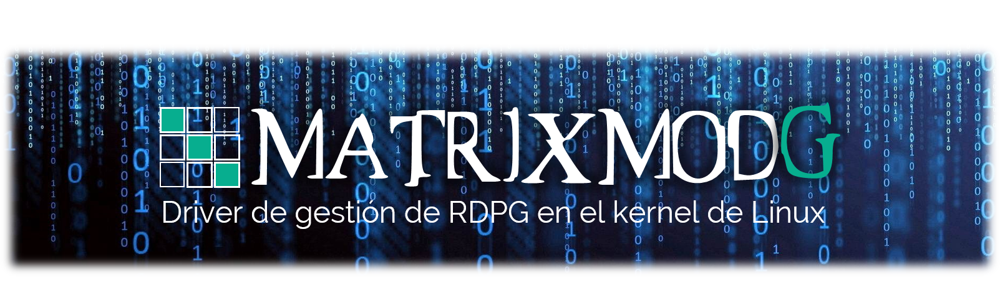

# Proyecto MatrixmodG
El proyecto MatrixmodG se basa en la creación de un device driver  Linux para gestionar Redes de Petri Generalizadas en el kernel.
Su objetivo principal es independizarse de cualquier lenguaje de programación para brindar su funcionalidades y rendimiento a todo el espacio usuario.

Con la misma idea de Linux, que se democratiza como sistema operativo, el proyecto MatrixmodG se democratiza para gestionar RDPG en el kernel de Linux con el objetivo de obtener un alto rendimiento y todas sus funcionalidades sobre cualquier lenguaje a través de la creación de sus respectivas librerías de espacio usuario.

El proyecto MatrixmodG es un proyecto open source (a código abierto) permitiendo que el proyecto sea libremente utilizado, estudiado, redistribuido y modificado por cualquier persona con los conocimientos informáticos y teóricos adecuados.

Para contribuir con el proyecto solicita participar en la creación del proyecto como contribuidor de Github o envía tu solicitud a gsosaludu@gmail.com.

Ver la [Wiki](https://github.com/gslAgile/Proyecto-MatrixmodG/wiki) para mas detalles.
