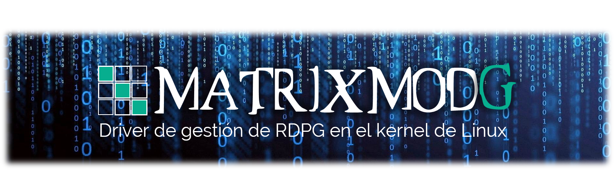

# Proyecto MatrixmodG
El proyecto MatrixmodG se basa en la creación de un device driver Linux para la gestión Redes de Petri Generalizadas en el kernel.
Su objetivo principal es aprovechar la capacidad de comunicación entre procesos del kernel y su rendimiento en la capa de aplicación, permitiendo la solución, simulación y control de problemas de concurrencia complejos mediante el uso de RDPG para programas y aplicaciones de concurrencia. Además la herramienta es totalmente independiente del lenguaje de programación a utilizar en espacio usuario y permite la solución, simulación y control de los problemas de concurrencia con una o multiples aplicaciones simultáneamente.

Al igual que Linux, el proyecto MatrixmodG se democratiza en referencia a como gestionar RDPG en el kernel de Linux con el objetivo de obtener sus benéficos desde aplicaciones y programas de espacio usuario.

El proyecto MatrixmodG es un proyecto open source (a código abierto) permitiendo ser libremente utilizado, estudiado, redistribuido y modificado por cualquier persona con los conocimientos informáticos y teóricos adecuados.

Contacto de autor gsosaludu@gmail.com.

Keywords: Red de Petri Generalizada, Device Driver Linux, Ambiente Multicore, Programación Paralela, Programación Concurrente.

Ver la [Wiki](https://github.com/gslAgile/Proyecto-MatrixmodG/wiki) para mas detalles.
 

# Descarga de Proyecto MatrixMoG
  

# Instalación de DDL MatrixModG
 

<!-- Comentarios

# Uso de librería libMatrixmodG

-->
